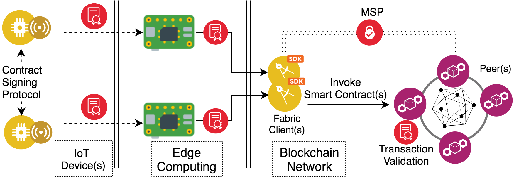

# IoTLogBlock 
Source code of the IoTLogBlock Achitecture (to be published) in <b>44th IEEE - LCN 2019</b> conference.
# Recording Off-line Transactions of Low-Power IoT Devices Using a Blockchain
<b>Chistos Profentzas</b>, Olaf Landsiedel, and Magnus Almgren. 2019. 
_In Proceedings of the International Conference on Local Computer Networks (LCN)_.
[paper](https://research.chalmers.se/en/publication/511927), [talk](./ContikiNG/lcn.pdf).



## Abstract

For any distributed system, and especially for the Internet of Things, recording interactions between devices is essential. 
At first glance, blockchain seems to be suitable for storing these interactions, as they allow multiple parties to share a ledger. 
However, at a closer look, blockchain requires heavy computations, large memory, and always-on communication; these are three properties that are challenging for IoT devices. 
In this paper, we present IoTLogBlock to address these challenges, which connects IoT devices to the blockchain, and it consists of <b>three building blocks: a contract signing protocol, a blockchain network, and a smart contract</b>. We evaluate our design on low-power devices and quantify the performance in terms of memory, computation, and energy consumption. Our results show that a constrained device can create a transaction within 3 s on average. Finally, we expose the devices to scenarios with edge connections ranging from 10 s to over 2 h.

## Implementation

We implement the contract signing protocol, in <b>C</b> for the <b>Contiki-NG OS</b>.

We implement the smart contract in <b>GO</b> for <b>Hyperledger-Fabric</b>.

We implement the API to interact with the smart contract in <b>Node.JS</b>.

We support Texas Instruments CC2538 SoC.

## Code structure

### Contract Signing Protocol code
Under [ContikiNG/IoTLogBlock](./ContikiNG/IoTLogBlock/).

The Originator of the protocol logic: [ContikiNG/IoTLogBlock/chain-originator.c](./ContikiNG/IoTLogBlock/chain-originator.c). 

The Responder of the protocol logic: [ContikiNG/IoTLogBlock/chain-responder.c](./ContikiNG/IoTLogBlock/chain-responder.c]). 


### Node.JS and Python Scripts
For Sending transaction to the Hyperledger Network:

### Configuring, Compiling, Flashing and Running on HW

#### Toolchain: Compiler
To compile, you need to install the GCC compiler toolchain and tell the Makefile where to find it.

<!-- We use [gcc-arm-none-eabi-7-2017-q4-major](https://developer.arm.com/open-source/gnu-toolchain/gnu-rm/downloads) -->
For the compiler, we use [gcc-arm-none-eabi-7-2017-q4-major](https://github.com/gnu-mcu-eclipse/arm-none-eabi-gcc/releases).
Download the binaries of this version of the compiler suitable to your system, then extract the archive on your system.
Consult [GNU MCU Eclipse page](https://gnu-mcu-eclipse.github.io/toolchain/arm/install/) for help.

You need to modify the following variable in the Makefile in accordance to your installation:
```
GCC_INSTALL_ROOT	:= ~/opt/gnu-mcu-eclipse/arm-none-eabi-gcc/7.2.1-1.1-20180401-0515
GCC_VERSION		:= 7.2.1
GCC_PREFIX		:= arm-none-eabi
```

#### Make parameters
We have the following configuration parameters to specify in compile time, with the `make` command:
```
TARGET=openmote-cc2538 # Default supported platform
MAKE_NET = MAKE_NET_IPV6 # Default uIP low-power IPv6 stack, with 6LoWPAN and RPL.

```

#### Make command examples
Compile command example:
```
make clean && make  
```

To program the connected mote:
```
 make TARGET=openmote-cc2538 PORT=/dev/tty.usbserial-[DEVICE PORT] chain-originator.upload
 
 make TARGET=openmote-cc2538 PORT=/dev/tty.usbserial-[DEVICE PORT] chain-responder.upload
```
